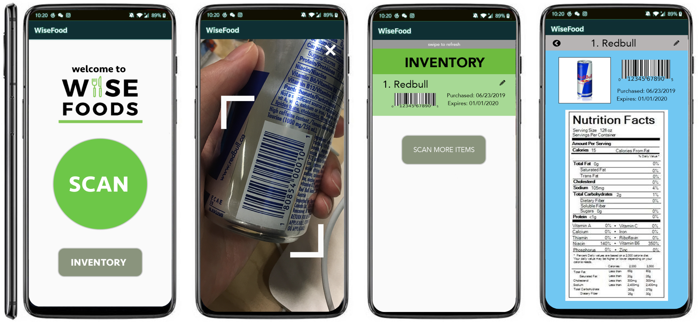

# WiseFoods

WiseFoods was created with the goal of addressing the issue of global food waste by empowering the consumer to make informed decisions. According to CBC Canada in 2019, more than 50% of all food produced in Canada is lost or wasted. All of this wasted food could have gone towards communities in need. 

### Some Features of Our App: 
 
1. Scan QR codes of food products 
2. Record all scanned products in an inventory system
3. Expiry date for each individually scanned product 
4. Copy as a plain text to use. 
5. Instant access to internet search of product

#### Usages Library & Purpose ####

**1. Material Barcode Scanner** - For Barcode & QR Code Scan. 

Dependency : `com.edwardvanraak:MaterialBarcodeScanner:0.0.6-ALPHA`

GitHub : https://github.com/EdwardvanRaak/MaterialBarcodeScanner

